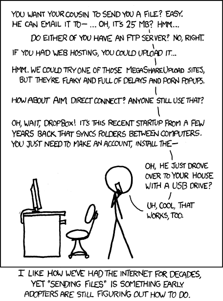
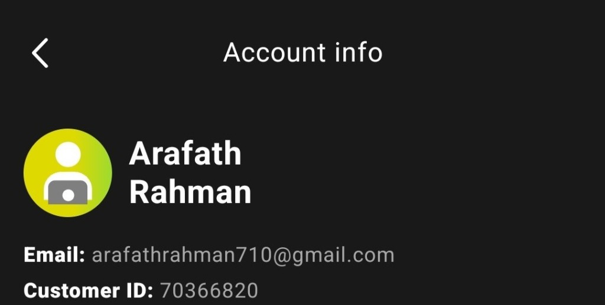

<div align="center">

<h1 align="center">Filelink</h1>

**Send files from one device to many, in real time — private, peer-to-peer, with no size limit.**

<p align="center">
<a href="https://github.com/smartworldarafath/Filelink-Sync/actions/workflows/release.yml"></a>&nbsp;<a href="https://github.com/smartworldarafath/Filelink-Sync/releases"></a>&nbsp;<a href="https://hub.docker.com/r/smartworldarafath/filelink"></a>&nbsp;<a href="LICENSE"></a>
</p>

<p align="center">
  🌐 <b>Live Web App (GitHub Pages):</b> <a href="https://smartworldarafath.github.io/Filelink-Sync/">https://smartworldarafath.github.io/Filelink-Sync/</a>
</p>

<br>


</div>

## Features

- 🔒 **Private by design** — files travel directly between browsers over encrypted WebRTC. The server only brokers the initial handshake; it never sees your file contents.
- 🚀 **No size limit** — received files stream straight to disk, so even multi-gigabyte transfers use almost no memory (over HTTPS — see [how files are saved](#how-received-files-are-saved)).
- 👥 **One-to-many** — share a room link or QR code and send to as many devices at once.
- 🌐 **Works across networks** — connects directly when possible, with automatic STUN/TURN relay fallback for restrictive NATs and firewalls.
- 🪄 **No installs, no accounts** — recipients just open a link in any modern browser. Optional password protection per room.
- 🐳 **Self-hosted** — a single Docker image you run yourself.

## Table of contents

- [Features](#features)
- [Table of contents](#table-of-contents)
- [How to use](#how-to-use)
- [Live Web App](#live-web-app)
- [Self-hosting](#self-hosting)
  - [Prerequisites](#prerequisites)
  - [Option A — HTTP (local network / quick start)](#option-a--http-local-network--quick-start)
  - [Option B — HTTPS (public domain, recommended)](#option-b--https-public-domain-recommended)
  - [Stopping Filelink](#stopping-filelink)
- [Required ports](#required-ports)
- [Customizing ports](#customizing-ports)
- [Configuration](#configuration)
- [How received files are saved](#how-received-files-are-saved)
- [Under the hood](#under-the-hood)
- [Author](#author)
- [License](#license)

## How to use

1. **Open** your Filelink URL — you land in a room with a unique link and a QR code.
2. **Share** the link (or QR) with the people or devices you want to send to.
3. **Drop in your files** — drag and drop them (or click **Send Files**). Recipients see them appear and can download instantly.

> Want to restrict access? Click **Add password** to protect the room before sharing the link.

## Live Web App

You can access and use Filelink immediately without installing anything via GitHub Pages:
👉 **[https://smartworldarafath.github.io/Filelink-Sync/](https://smartworldarafath.github.io/Filelink-Sync/)**

## Self-hosting

### Prerequisites

- [Docker](https://docs.docker.com/get-docker/) and [Docker Compose](https://docs.docker.com/compose/install/)
- Python 3 (only to generate the secret key below)

Every deployment needs a **secret key** (it signs the TURN credentials used for NAT traversal). Generate one with:

```bash
python3 -c "import secrets, base64; print(base64.b64encode(secrets.token_bytes(32)).decode())"
```

> ⚠️ Use your **own** generated value — never ship the examples shown below.

### Option A — HTTP (local network / quick start)

Best for trying Filelink or running it on a trusted LAN. Note that large transfers (>~500 MB) are unreliable over plain HTTP — for those, use [Option B](#option-b--https-public-domain-recommended).

**1. Download** [`deploy/docker-compose.yml`](deploy/docker-compose.yml).

**2. Set your secret.** Replace **both** `<SECRET_KEY>` placeholders with your generated value:

```yaml
# (use your own generated value — these are illustrative)
- --static-auth-secret=Hs9k…your-generated-key…=
- SECRET_KEY=Hs9k…your-generated-key…=
```

**3. Start it:**

```bash
docker compose up -d
```

Open **`http://localhost`** (or your server's IP).

### Option B — HTTPS (public domain, recommended)

Caddy obtains and renews a Let's Encrypt certificate automatically. HTTPS also unlocks memory-safe streaming for files of any size.

**1. Download** [`deploy/docker-compose-ssl.yml`](deploy/docker-compose-ssl.yml) and [`deploy/Caddyfile`](deploy/Caddyfile).

**2. Set your secret.** Replace **both** `<SECRET_KEY>` placeholders (same as Option A).

**3. Set your domain.** In `Caddyfile`, replace `yourdomain.com` with your domain:

```caddyfile
filelink.example.com {
    header Strict-Transport-Security "max-age=31536000; include-subdomains"
    reverse_proxy filelink:80
}
```

**4. Start it:**

```bash
docker compose -f docker-compose-ssl.yml up -d
```

Open **`https://yourdomain.com`**.

### Stopping Filelink

```bash
docker compose down                          # HTTP setup
docker compose -f docker-compose-ssl.yml down  # HTTPS setup
```

## Required ports

Open these on your server/firewall to expose Filelink to the internet:

| Port | Protocol | Purpose |
|---|---|---|
| `80` *(HTTP)* / `443` *(HTTPS)* | TCP | Web interface |
| `3478` | TCP + UDP | STUN/TURN — peer-to-peer connection setup |
| `50000–50100` | UDP | TURN relay range — used when a direct connection isn't possible |

> Port `3478` handles connection setup. The `50000–50100` UDP range carries relayed traffic for the ~5–10% of connections that can't go direct (typically a peer behind symmetric NAT or a UDP-blocking firewall).

## Customizing ports

**HTTP port.** In `docker-compose.yml`, change the **first** number of the `filelink` port mapping (the second is the internal container port — leave it as `80`):

```yaml
ports:
  - "8080:80"   # serve on http://localhost:8080
```

**HTTPS port.** Keep Caddy on `443` and put your own reverse proxy (Nginx, Traefik, standalone Caddy) in front if you need a non-standard external port — terminate TLS there and forward to Filelink's internal HTTP port.

## Configuration

Environment variables on the `filelink` service:

| Variable | Required | Default | Description |
|---|---|---|---|
| `SECRET_KEY` | **Yes** | — | Signs TURN credentials and tokens. Must match the coturn `--static-auth-secret`. The app won't start without it. |

## How received files are saved

Filelink writes received files to disk as the bytes arrive, so transfers use almost no memory regardless of size. It uses the first method the browser supports, falling back in order:

1. **File System Access API** — streams straight to a file you pick. Desktop Chromium browsers (Chrome, Edge, Brave, Opera) over HTTPS.
2. **Service Worker** — streams into a normal browser download. All modern browsers over HTTPS.
3. **Blob** — buffers the whole file in memory, then saves it. Last resort; the only option over plain HTTP, and unreliable past ~500 MB.

The first two require a secure context (HTTPS, or `localhost`), so **serving Filelink over HTTPS is recommended** — it enables memory-safe transfers of any size.

## Under the hood

Filelink uses native [WebRTC](https://developer.mozilla.org/en-US/docs/Web/API/WebRTC_API) to transfer files directly between devices — peer-to-peer, with no intermediate server in the data path. Your files stay private throughout.

A lightweight WebSocket signaling server (served at `/ws` by the Filelink app itself) assists only with the initial connection setup — relaying SDP offers/answers and ICE candidates between peers. Once a peer-to-peer connection is established, the signaling server steps back and file bytes flow directly between browsers. **The server never has access to file contents.**




---

## ☕ Support / Buy Me a Coffee & Become a Sponsor

If you find **Filelink Sync** helpful and want to support ongoing development, maintenance, and new features, consider contributing through any of the options below! Your support means the world and helps keep this project open-source.

<div align="center">

<table>
  <tr>
    <td align="center" width="25%" valign="top">
      <h4>☕ SupportKori</h4>
      <a href="https://www.supportkori.com/arafathrahman" target="_blank">
        
      </a><br/><br/>
      <a href="https://www.supportkori.com/arafathrahman" target="_blank">
        
      </a><br/>
      <sub>Cards / bKash / Nagad / Global</sub>
    </td>
    <td align="center" width="25%" valign="top">
      <h4>⚡ nsave</h4>
      <br/><br/>
      <br/>
      <sub>Ntag: <code>@arafath_rahman9</code></sub>
    </td>
    <td align="center" width="25%" valign="top">
      <h4>🔴 RedotPay</h4>
      <br/><br/>
      <br/>
      <sub>ID: <code>1965421414</code></sub>
    </td>
    <td align="center" width="25%" valign="top">
      <h4>🅿️ Payoneer</h4>
      <br/><br/>
      <a href="mailto:arafathrahman710@gmail.com?subject=Support%20via%20Payoneer">
        
      </a><br/>
      <sub>Email: <code>arafathrahman710@gmail.com</code></sub>
    </td>
  </tr>
</table>

<br/>

| Method | Details / Direct Link |
| :--- | :--- |
| **☕ SupportKori** | [https://www.supportkori.com/arafathrahman](https://www.supportkori.com/arafathrahman) |
| **⚡ nsave** | Ntag: `@arafath_rahman9` • `Md Arafath Rahman` |
| **🔴 RedotPay** | Account ID: `1965421414` |
| **🅿️ Payoneer** | Email: `arafathrahman710@gmail.com` • Customer ID: `70366820` |

</div>

## Author

Created & maintained by **Arafath Rahman** ([@smartworldarafath](https://github.com/smartworldarafath)).

## License

Released under the [MIT License](LICENSE).
